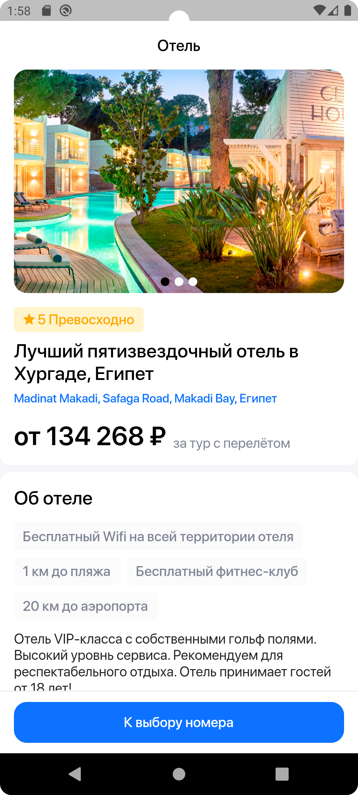
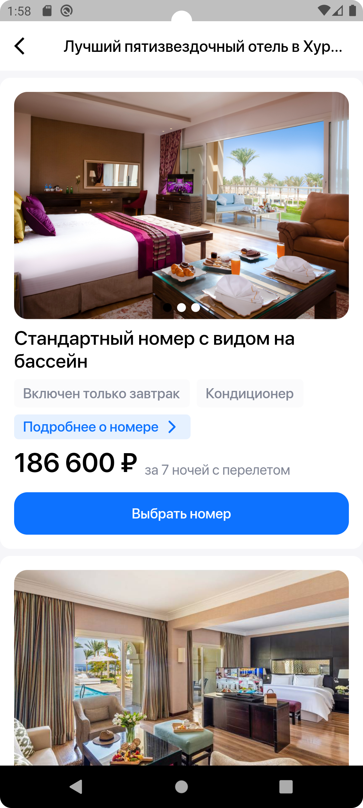
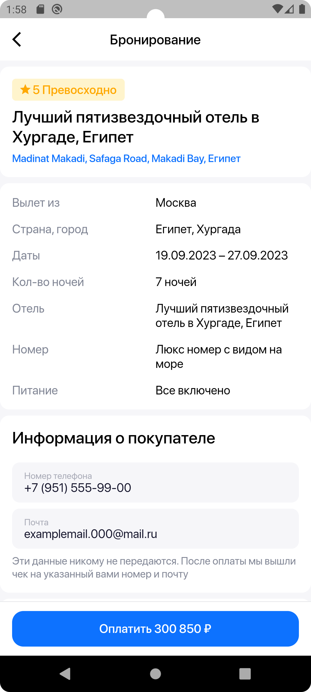
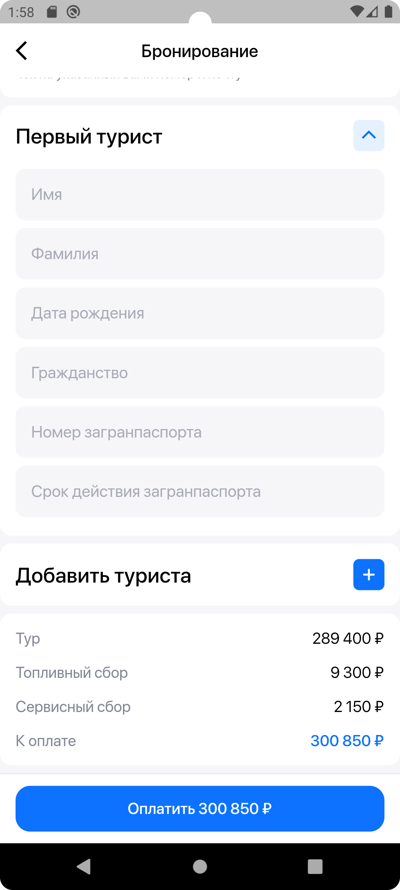
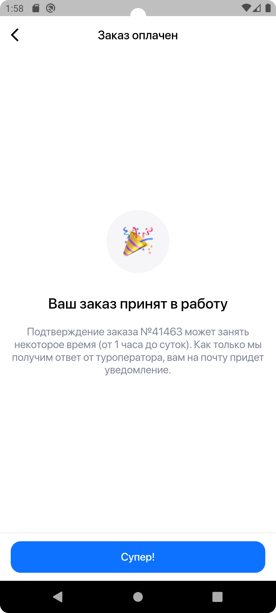

# Тестовое задание "Мобильное приложение бронирования номеров отеля"
Поддержка Android 10.0+

## Рекомендуемый стек технологий:
* Dart
* Block (Или любой стейт менеджер)
* Clean Architecture
* Retrofit

## Скриншоты приложения:

  
Отель (главный экран)

  

  
Номер

    
  

  
Бронирование

    
  
  

  
Оплачено

    
  

## Видео работы приложения:
https://github.com/dimalepel/hotel_test_app/assets/10213719/df1293ea-981e-43f6-8e2d-ec7b5f081e4f

## Скачать приложение можно отсканировав QR-код:

## План по улучшению приложения:
* [ ] Педелать экран загрузки, что бы изображение не ломало пропорции
* [ ] Оптимизировать структуру кода, вынести оставшиеся повторяющиеся элементы в отдельные виджеты
* [ ] Обработать ошибки загрузки изображения по сети
* [ ] Обработать ошибки получения данных по сети (показывать полььзователю соответсвующие сообщение)
* [ ] Доделать валидатор адреса электронной почты
* [ ] Добавить анимацию ввода номера телефона
* [ ] Исправить работу контроллеров даты (в разные поля у одного туриста вводится одна и та же дата)

> Данные, которые отправляет приложение можно просмотреть по ссылке: https://webhook.site/#!/c9d636b4-1e5d-4ddf-a17e-46e3cbd45166/f405da81-1a81-427f-b508-0b8d16bc621c/1

